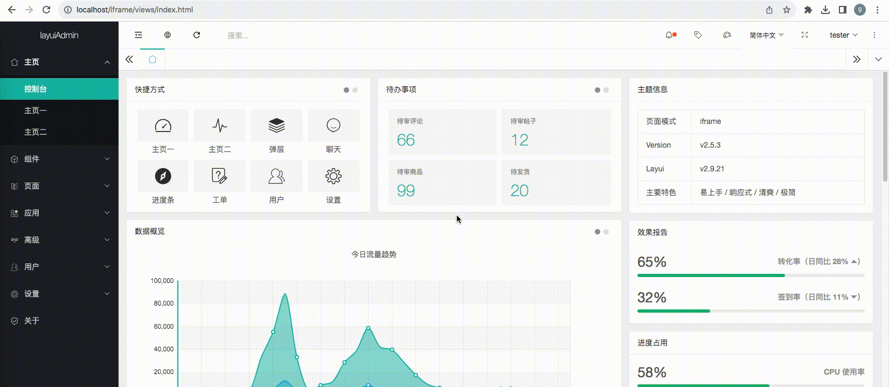

<h1 align="center">
    translate.js
</h1>
<h4 align="center">
    It is an AI i18n tool designed for front-end developers. With just two lines of JavaScript code, it can achieve fully automatic translation of HTML.  <br/>
    Leave it to the AI. There is no need to modify the page, no language configuration file is required, no API Key is needed, and it is SEO-friendly! 
</h4> 

  


# Usage method
### 1. Deploy the text translation API
First, deploy the text translation open interface. It supports batch translation of multiple texts at once and has a built-in multi-layer caching system, which minimizes the time-consuming process of AI translation. This enables users to achieve instant and delay-free translation when using it. 

##### 1.1 Server specifications
It can run perfectly with the following server configuration: 1 core, 1GB of memory, a 20GB system disk, a bandwidth of 1MB, and the operating system being CentOS 7.4 (any version from 7.0 to 7.9 is acceptable).  

##### 1.2 Install
````
wget https://gitee.com/mail_osc/translate/raw/master/deploy/install_translate.service.sh -O install.sh && chmod -R 777 install.sh && sh ./install.sh
````

##### 1.3 Configure DeepSeek parameters

Edit application.properties ，Edit command：
````
vi /mnt/tomcat8/webapps/ROOT/WEB-INF/classes/application.properties
````
Then append a few lines of configuration at the very end:  
````
# The request URL of the large model interface. For example, the following is the request URL of Huawei DeepSeek. Additionally, the request URL of GiteeAI is https://ai.gitee.com/v1/chat/completions , You can obtain and fill in the information for other platforms by yourself. 
translate.service.deepSeek.url=https://infer-modelarts-cn-southwest-2.modelarts-infer.com/v1/infers/fd53915b-8935-48fe-be70-449d76c0fc87/v1/chat/completions
# Access token
translate.service.deepSeek.key=QM8jrVl98lTluLhzCaO4i9PFv-caRk6U7kDL-H6CIyApytMG69jO33aasO1GnduQak8fGI7dtpmbsM98Qh3ywA
# Which model to use? Here, it is advisable to use DeepSeek-V3 by default, and there is no need to make any changes.  
translate.service.deepSeek.model=DeepSeek-V3
# The maximum number of tokens for a single AI operation. If not set, the default value is 3000. You can just use this default value here.  
translate.service.deepSeek.max_tokens=3000
````
The final effect is shown in the following figure: 


##### 1.4 Restart the service
````
pkill java
sudo /mnt/tomcat8/bin/startup.sh
````

##### 1.5 Test the text translation API.
  
The "from" passed in here represents the language before translation. If you know what language it is, fill it in. If you don't know and it's difficult to judge, just fill it in as shown in the picture above. DeepSeek will automatically recognize and perform the translation. 
For detailed instructions on this translation API interface, please refer to: [http://api.zvo.cn/translate/service/20230807/translate.json.html](http://api.zvo.cn/translate/service/20230807/translate.json.html)


### 2. Use translate.js in HTML.

**Click on a certain language in an ordinary website to switch. **   

As shown in the following figure, there should be an option to switch among several languages at a certain position on the website. 
  
Directly add the following code at the end of its HTML code: 

````
<!-- Add a button for switching to a certain language. Note that a `class="ignore"` is added to the `ul` tag, which means that this piece of code will not be translated.  -->
<ul class="ignore">
	<li><a href="javascript:translate.changeLanguage('english');">English</a></li>|
	<li><a href="javascript:translate.changeLanguage('chinese_simplified');">简体中文</a></li>|
	<li><a href="javascript:translate.changeLanguage('chinese_traditional');">繁體中文</a></li>
</ul>

<!-- Introduce the JavaScript for multi-language switching. -->
<script src="https://res.zvo.cn/translate/translate.js"></script>
<script>
	//Do not display the default select option for choosing languages. 
	translate.selectLanguageTag.show = false; 
	//Set the host of the text translation API, which is the text translation API we deployed in the first step above. For more information about this, please refer to https://translate.zvo.cn/4068.html. 
	translate.request.api.host='http://121.36.23.238/'; 
	//Translation triggers initialization.
	translate.execute();
</script>
````

This is just the use in the most common scenario. In addition, for various frameworks such as VUE, React, and so on, as well as all kinds of management backends, as long as JavaScript can be run, it can be used! 

# Open-source repository
https://github.com/xnx3/translate  

